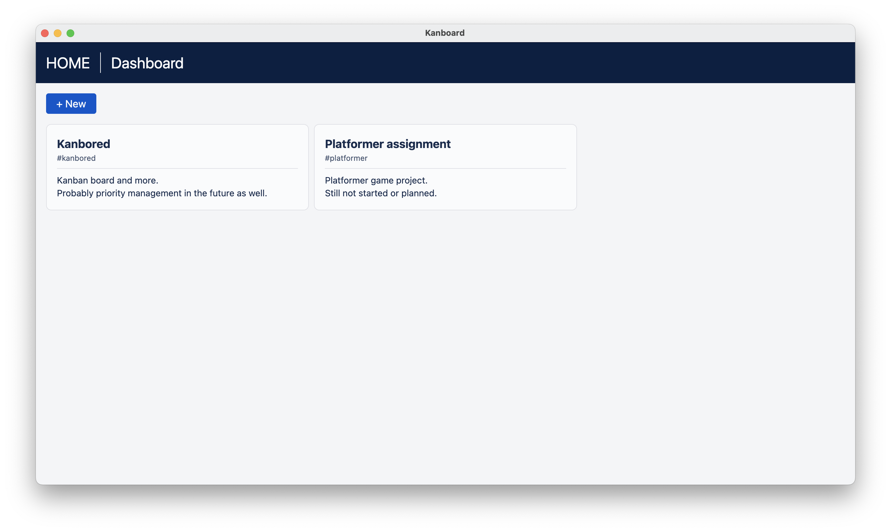
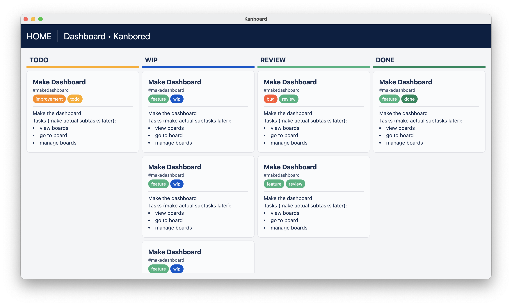

# Kanbored (WIP)

Offline kanban board and more. Built on electron.

Not functional as of now. Still in early stages.

Planned features:

-   multiple project support
-   offline support
-   custom states
-   custom tags
-   media saving
-   versioning
-   task dependency (task > task, version > task, cross project i.e. engine > game)
-   backup (i.e. zip import/export)

## Screenshots




## How to build

To start the project:

```sh
npm run start
```

To create the executable:

```sh
npm run make
```
